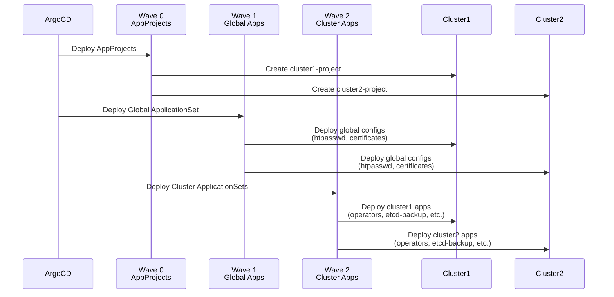

# ArgoCD Application Structure Diagram

## Application Hierarchy (Mermaid)

```mermaid
graph TD
    Root[app-of-apps<br/>Root Application] --> Wave0[Wave 0: AppProjects]
    Root --> Wave1[Wave 1: Global ApplicationSet]
    Root --> Wave2[Wave 2: Cluster ApplicationSets]
    
    Wave0 --> Proj1[cluster1-project]
    Wave0 --> Proj2[cluster2-project]
    
    Wave1 --> GlobalAS[global ApplicationSet]
    GlobalAS --> GlobalApp1[cluster1-htpasswd]
    GlobalAS --> GlobalApp2[cluster1-certificates]
    GlobalAS --> GlobalApp3[cluster2-htpasswd]
    GlobalAS --> GlobalApp4[cluster2-certificates]
    
    Wave2 --> Cluster1AS[cluster1 ApplicationSet]
    Wave2 --> Cluster2AS[cluster2 ApplicationSet]
    
    Cluster1AS --> App1[cluster1-cluster-scope]
    Cluster1AS --> App2[cluster1-operators]
    Cluster1AS --> App3[cluster1-etcd-backup]
    Cluster1AS --> App4[cluster1-machineconfig]
    Cluster1AS --> App5[cluster1-garbagecollection]
    
    Cluster2AS --> App6[cluster2-cluster-scope]
    Cluster2AS --> App7[cluster2-operators]
    Cluster2AS --> App8[cluster2-etcd-backup]
    Cluster2AS --> App9[cluster2-machineconfig]
    Cluster2AS --> App10[cluster2-garbagecollection]
    
    style Root fill:#e1f5ff
    style Wave0 fill:#fff4e1
    style Wave1 fill:#e8f5e9
    style Wave2 fill:#fce4ec
    style GlobalAS fill:#c8e6c9
    style Cluster1AS fill:#f8bbd0
    style Cluster2AS fill:#f8bbd0
```

## Sync Wave Flow

```mermaid
sequenceDiagram
    participant ArgoCD
    participant Wave0 as Wave 0<br/>AppProjects
    participant Wave1 as Wave 1<br/>Global Apps
    participant Wave2 as Wave 2<br/>Cluster Apps
    participant Cluster1
    participant Cluster2
    
    ArgoCD->>Wave0: Deploy AppProjects
    Wave0->>Cluster1: Create cluster1-project
    Wave0->>Cluster2: Create cluster2-project
    
    ArgoCD->>Wave1: Deploy Global ApplicationSet
    Wave1->>Cluster1: Deploy global configs<br/>(htpasswd, certificates)
    Wave1->>Cluster2: Deploy global configs<br/>(htpasswd, certificates)
    
    ArgoCD->>Wave2: Deploy Cluster ApplicationSets
    Wave2->>Cluster1: Deploy cluster1 apps<br/>(operators, etcd-backup, etc.)
    Wave2->>Cluster2: Deploy cluster2 apps<br/>(operators, etcd-backup, etc.)
```

