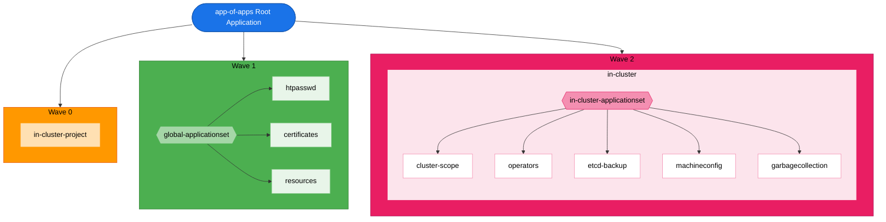
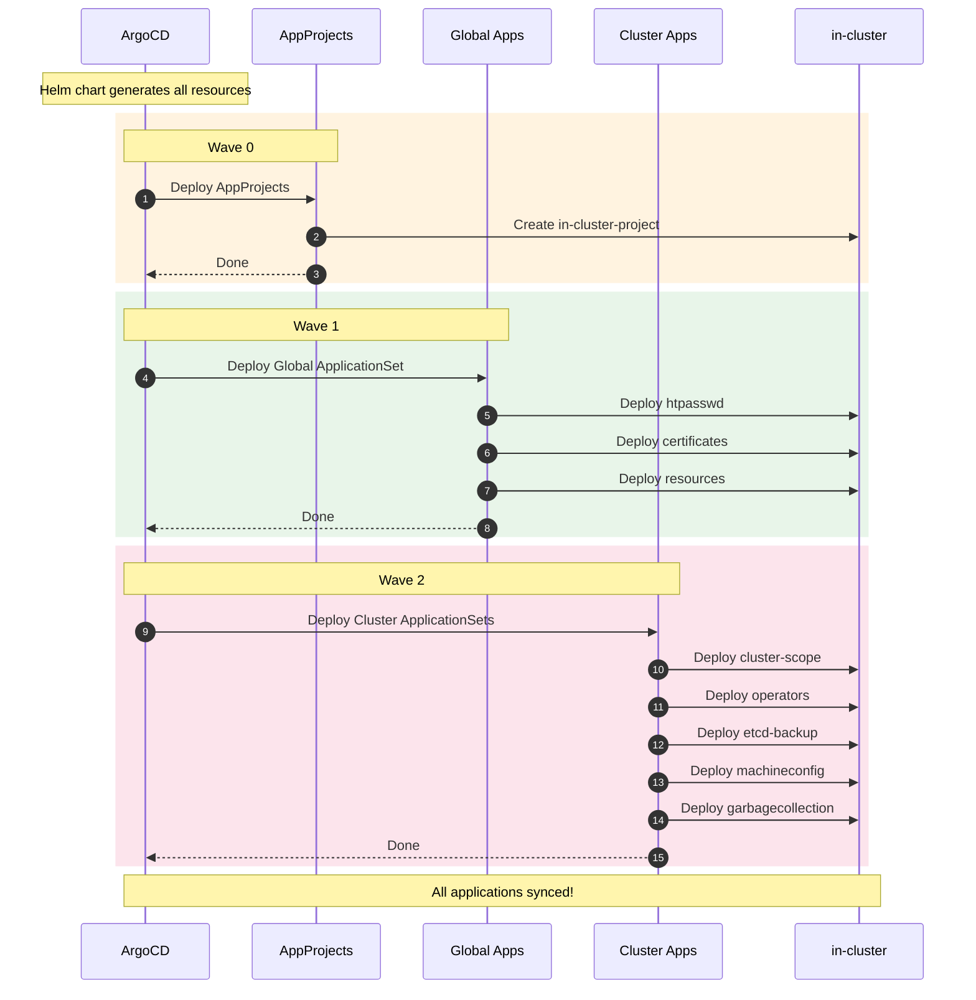
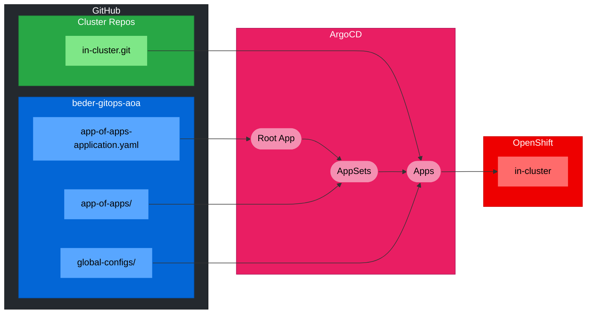

# ArgoCD Application Structure Diagram

## Application Hierarchy

## Sync Wave Flow

## Repository Relationship

## Legend

| Symbol | Meaning |
|--------|---------|
| Wave 0 (Orange) | AppProjects |
| Wave 1 (Green) | Global Configurations |
| Wave 2 (Pink) | Cluster-specific Apps |
| Diamond shape | ApplicationSet |
| Stadium shape | Application |
| Rectangle | Resource/Config |

