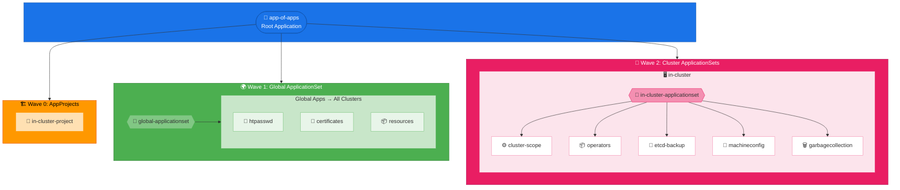
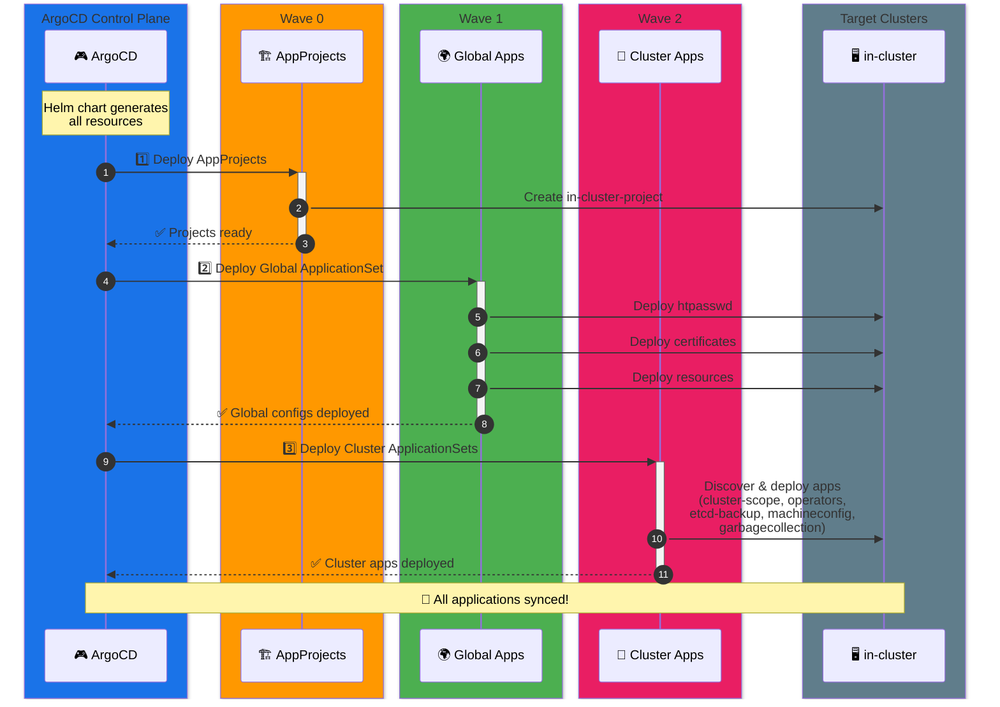
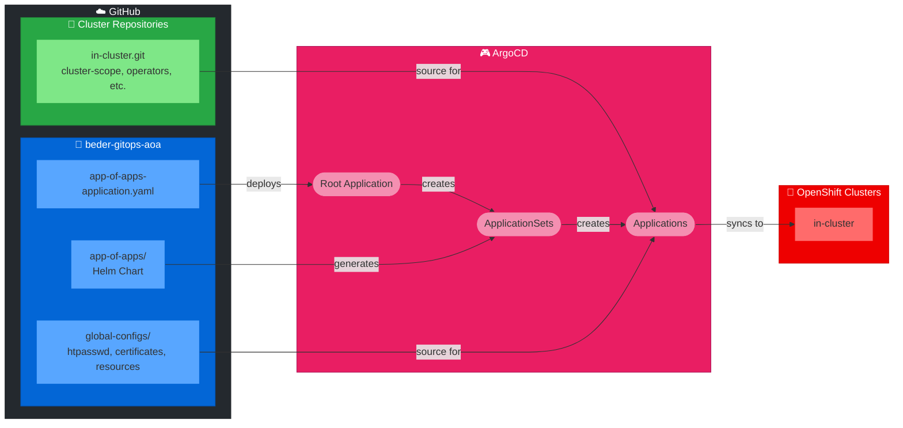

# ArgoCD Application Structure Diagram

## Application Hierarchy

## Sync Wave Flow

## Repository Relationship

## Legend

| Symbol | Meaning |
|--------|---------|
| 🚀 | Root Application |
| 🏗️ | AppProjects (Wave 0) |
| 🌍 | Global Configurations (Wave 1) |
| 🎯 | Cluster-specific Apps (Wave 2) |
| 🔄 | ApplicationSet |
| 📁 | AppProject |
| 🖥️ | Cluster |
| ⚙️ | Configuration |
| 📦 | Operators/Resources |
| 🔐 | Authentication |
| 📜 | Certificates |
| 💾 | Backup |
| 🔧 | Machine Config |
| 🗑️ | Garbage Collection |

