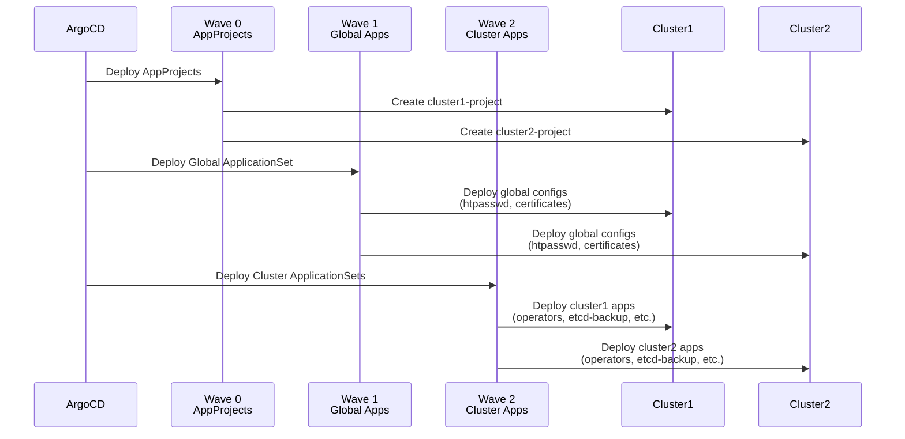
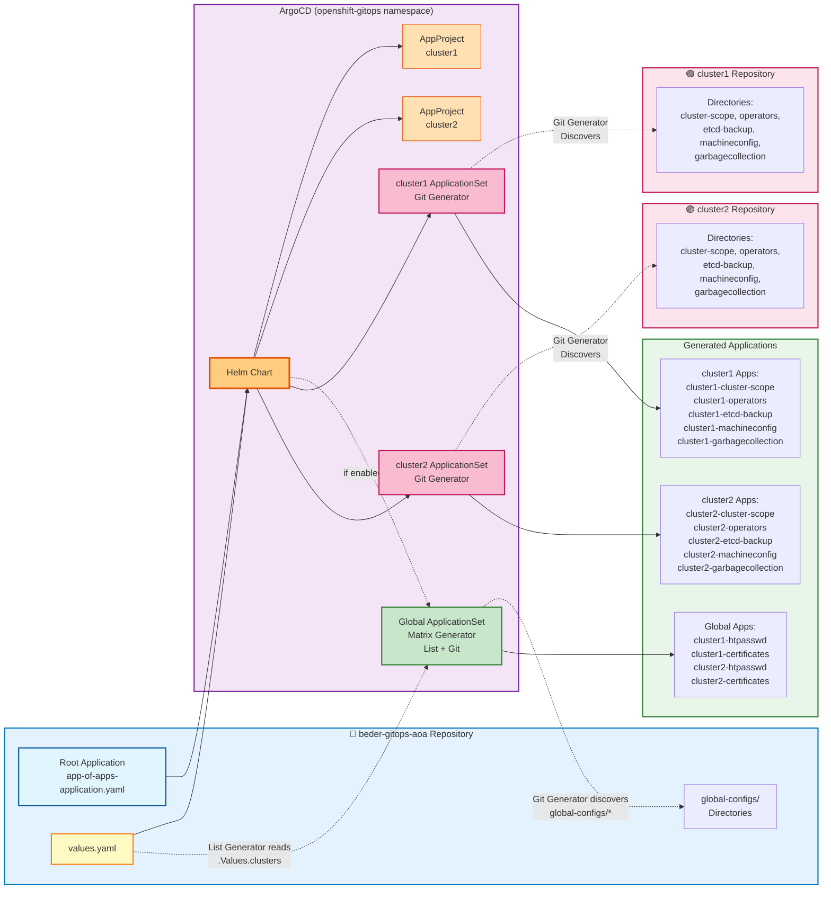
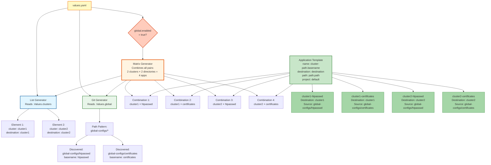

# ArgoCD Application Structure Diagram

## Application Hierarchy (Mermaid)

```mermaid
graph TD
    Root[app-of-apps<br/>Root Application] --> Wave0[Wave 0: AppProjects]
    Root --> Wave1[Wave 1: Global ApplicationSet]
    Root --> Wave2[Wave 2: Cluster ApplicationSets]
    
    Wave0 --> Proj1[cluster1-project]
    Wave0 --> Proj2[cluster2-project]
    
    Wave1 --> GlobalAS[global ApplicationSet]
    GlobalAS --> GlobalApp1[cluster1-htpasswd]
    GlobalAS --> GlobalApp2[cluster1-certificates]
    GlobalAS --> GlobalApp3[cluster2-htpasswd]
    GlobalAS --> GlobalApp4[cluster2-certificates]
    
    Wave2 --> Cluster1AS[cluster1 ApplicationSet]
    Wave2 --> Cluster2AS[cluster2 ApplicationSet]
    
    Cluster1AS --> App1[cluster1-cluster-scope]
    Cluster1AS --> App2[cluster1-operators]
    Cluster1AS --> App3[cluster1-etcd-backup]
    Cluster1AS --> App4[cluster1-machineconfig]
    Cluster1AS --> App5[cluster1-garbagecollection]
    
    Cluster2AS --> App6[cluster2-cluster-scope]
    Cluster2AS --> App7[cluster2-operators]
    Cluster2AS --> App8[cluster2-etcd-backup]
    Cluster2AS --> App9[cluster2-machineconfig]
    Cluster2AS --> App10[cluster2-garbagecollection]
    
    style Root fill:#e1f5ff
    style Wave0 fill:#fff4e1
    style Wave1 fill:#e8f5e9
    style Wave2 fill:#fce4ec
    style GlobalAS fill:#c8e6c9
    style Cluster1AS fill:#f8bbd0
    style Cluster2AS fill:#f8bbd0
```

## Sync Wave Flow

```mermaid
sequenceDiagram
    participant ArgoCD
    participant Wave0 as Wave 0<br/>AppProjects
    participant Wave1 as Wave 1<br/>Global Apps
    participant Wave2 as Wave 2<br/>Cluster Apps
    participant Cluster1
    participant Cluster2
    
    ArgoCD->>Wave0: Deploy AppProjects
    Wave0->>Cluster1: Create cluster1-project
    Wave0->>Cluster2: Create cluster2-project
    
    ArgoCD->>Wave1: Deploy Global ApplicationSet
    Wave1->>Cluster1: Deploy global configs<br/>(htpasswd, certificates)
    Wave1->>Cluster2: Deploy global configs<br/>(htpasswd, certificates)
    
    ArgoCD->>Wave2: Deploy Cluster ApplicationSets
    Wave2->>Cluster1: Deploy cluster1 apps<br/>(operators, etcd-backup, etc.)
    Wave2->>Cluster2: Deploy cluster2 apps<br/>(operators, etcd-backup, etc.)
```

## Repository Structure Flow

```mermaid
graph LR
    subgraph AOA["🔵 beder-gitops-aoa Repository"]
        RootApp[Root Application<br/>app-of-apps-application.yaml]
        Values[values.yaml]
        GlobalDir[global-configs/<br/>Directories]
    end
    
    subgraph C1Repo["🟣 cluster1 Repository"]
        C1Dirs[Directories:<br/>cluster-scope, operators,<br/>etcd-backup, machineconfig,<br/>garbagecollection]
    end
    
    subgraph C2Repo["🟣 cluster2 Repository"]
        C2Dirs[Directories:<br/>cluster-scope, operators,<br/>etcd-backup, machineconfig,<br/>garbagecollection]
    end
    
    subgraph ArgoCD["ArgoCD (openshift-gitops namespace)"]
        Helm[Helm Chart]
        Proj1[AppProject<br/>cluster1]
        Proj2[AppProject<br/>cluster2]
        GlobalAS[Global ApplicationSet<br/>Matrix Generator<br/>List + Git]
        C1AS[cluster1 ApplicationSet<br/>Git Generator]
        C2AS[cluster2 ApplicationSet<br/>Git Generator]
    end
    
    subgraph Apps["Generated Applications"]
        GlobalApps[Global Apps:<br/>cluster1-htpasswd<br/>cluster1-certificates<br/>cluster2-htpasswd<br/>cluster2-certificates]
        C1Apps[cluster1 Apps:<br/>cluster1-cluster-scope<br/>cluster1-operators<br/>cluster1-etcd-backup<br/>cluster1-machineconfig<br/>cluster1-garbagecollection]
        C2Apps[cluster2 Apps:<br/>cluster2-cluster-scope<br/>cluster2-operators<br/>cluster2-etcd-backup<br/>cluster2-machineconfig<br/>cluster2-garbagecollection]
    end
    
    RootApp --> Helm
    Values --> Helm
    Helm --> Proj1
    Helm --> Proj2
    Helm -.->|if enabled: true| GlobalAS
    Helm --> C1AS
    Helm --> C2AS
    
    Values -.->|List Generator reads<br/>.Values.clusters| GlobalAS
    GlobalAS -.->|Git Generator discovers<br/>global-configs/*| GlobalDir
    C1AS -.->|Git Generator<br/>Discovers| C1Dirs
    C2AS -.->|Git Generator<br/>Discovers| C2Dirs
    
    GlobalAS --> GlobalApps
    C1AS --> C1Apps
    C2AS --> C2Apps
    
    style RootApp fill:#e1f5ff,stroke:#01579b,stroke-width:2px
    style Values fill:#fff9c4,stroke:#f57f17,stroke-width:2px
    style Helm fill:#ffcc80,stroke:#e65100,stroke-width:3px
    style GlobalAS fill:#c8e6c9,stroke:#2e7d32,stroke-width:2px
    style C1AS fill:#f8bbd0,stroke:#c2185b,stroke-width:2px
    style C2AS fill:#f8bbd0,stroke:#c2185b,stroke-width:2px
    style Proj1 fill:#ffe0b2,stroke:#e65100,stroke-width:1px
    style Proj2 fill:#ffe0b2,stroke:#e65100,stroke-width:1px
    style AOA fill:#e3f2fd,stroke:#0277bd,stroke-width:2px
    style C1Repo fill:#fce4ec,stroke:#c2185b,stroke-width:2px
    style C2Repo fill:#fce4ec,stroke:#c2185b,stroke-width:2px
    style ArgoCD fill:#f3e5f5,stroke:#7b1fa2,stroke-width:2px
    style Apps fill:#e8f5e9,stroke:#2e7d32,stroke-width:2px
```

## ApplicationSet Matrix Generator

```mermaid
graph TD
    Values[values.yaml] --> ListGen[List Generator<br/>Reads .Values.clusters]
    Values --> GitGen[Git Generator<br/>Reads .Values.global]
    
    ListGen --> E1[Element 1:<br/>cluster: cluster1<br/>destination: cluster1]
    ListGen --> E2[Element 2:<br/>cluster: cluster2<br/>destination: cluster2]
    
    GitGen --> Pattern[Path Pattern:<br/>global-configs/*]
    Pattern --> D1[Discovered:<br/>global-configs/htpasswd<br/>basename: htpasswd]
    Pattern --> D2[Discovered:<br/>global-configs/certificates<br/>basename: certificates]
    
    Matrix[Matrix Generator<br/>Combines all pairs:<br/>2 clusters × 2 directories = 4 apps] --> ListGen
    Matrix --> GitGen
    
    Matrix --> Comb1[Combination 1:<br/>cluster1 × htpasswd]
    Matrix --> Comb2[Combination 2:<br/>cluster1 × certificates]
    Matrix --> Comb3[Combination 3:<br/>cluster2 × htpasswd]
    Matrix --> Comb4[Combination 4:<br/>cluster2 × certificates]
    
    Template[Application Template<br/>name: cluster-path.basename<br/>destination: destination<br/>path: path.path<br/>project: default] --> Comb1
    Template --> Comb2
    Template --> Comb3
    Template --> Comb4
    
    Template --> App1[cluster1-htpasswd<br/>Destination: cluster1<br/>Source: global-configs/htpasswd]
    Template --> App2[cluster1-certificates<br/>Destination: cluster1<br/>Source: global-configs/certificates]
    Template --> App3[cluster2-htpasswd<br/>Destination: cluster2<br/>Source: global-configs/htpasswd]
    Template --> App4[cluster2-certificates<br/>Destination: cluster2<br/>Source: global-configs/certificates]
    
    Condition{global.enabled<br/>= true?} --> Matrix
    Values --> Condition
    
    style Values fill:#fff9c4,stroke:#f57f17,stroke-width:2px
    style Matrix fill:#fff4e1,stroke:#e65100,stroke-width:3px
    style ListGen fill:#e1f5ff,stroke:#01579b,stroke-width:2px
    style GitGen fill:#e8f5e9,stroke:#2e7d32,stroke-width:2px
    style Template fill:#c8e6c9,stroke:#2e7d32,stroke-width:2px
    style Condition fill:#ffccbc,stroke:#d84315,stroke-width:2px
    style App1 fill:#a5d6a7,stroke:#2e7d32,stroke-width:1px
    style App2 fill:#a5d6a7,stroke:#2e7d32,stroke-width:1px
    style App3 fill:#a5d6a7,stroke:#2e7d32,stroke-width:1px
    style App4 fill:#a5d6a7,stroke:#2e7d32,stroke-width:1px
```

