# ArgoCD Application Structure Diagrams

## Legend

- 📦 **ApplicationSet** - Generates multiple Applications
- ✅ **Application** - ArgoCD Application resource
- 📁 **AppProject** - ArgoCD Project resource
- 🖥️ **Cluster** - Target OpenShift cluster
- 🔄 **Sync Wave** - Deployment order indicator

**Color Coding:**
- 🔵 Blue: Root Application and AppProjects
- 🟢 Green: Global ApplicationSet and Applications
- 🟣 Purple: Cluster ApplicationSets
- 🟡 Yellow: Cluster-specific Applications
- 🟠 Orange: Helm Chart and Configuration

---

## 1. Application Hierarchy (Enhanced)

```mermaid
graph TD
    Root[📦 app-of-apps<br/>Root Application<br/>namespace: openshift-gitops] --> Wave0[Wave 0: AppProjects<br/>Sync Wave: 0]
    Root --> Wave1[Wave 1: Global ApplicationSet<br/>Sync Wave: 1]
    Root --> Wave2[Wave 2: Cluster ApplicationSets<br/>Sync Wave: 2]
    
    subgraph Wave0Group[" "]
        Wave0 --> Proj1[📁 cluster1-project<br/>Project: cluster1<br/>Wave: 0]
        Wave0 --> Proj2[📁 cluster2-project<br/>Project: cluster2<br/>Wave: 0]
    end
    
    subgraph Wave1Group[" "]
        Wave1 --> GlobalAS[📦 global ApplicationSet<br/>namespace: openshift-gitops<br/>Wave: 1<br/>enabled: true]
        
        subgraph GlobalApps["Global Applications (Generated)"]
            GlobalAS --> GlobalApp1[✅ cluster1-htpasswd<br/>Destination: cluster1<br/>Source: global-configs/htpasswd]
            GlobalAS --> GlobalApp2[✅ cluster1-certificates<br/>Destination: cluster1<br/>Source: global-configs/certificates]
            GlobalAS --> GlobalApp3[✅ cluster2-htpasswd<br/>Destination: cluster2<br/>Source: global-configs/htpasswd]
            GlobalAS --> GlobalApp4[✅ cluster2-certificates<br/>Destination: cluster2<br/>Source: global-configs/certificates]
        end
    end
    
    subgraph Wave2Group[" "]
        Wave2 --> Cluster1AS[📦 cluster1 ApplicationSet<br/>namespace: openshift-gitops<br/>Wave: 2]
        Wave2 --> Cluster2AS[📦 cluster2 ApplicationSet<br/>namespace: openshift-gitops<br/>Wave: 2]
        
        subgraph Cluster1Apps["Cluster1 Applications (Generated)"]
            Cluster1AS --> App1[✅ cluster1-cluster-scope<br/>Destination: cluster1<br/>Project: cluster1]
            Cluster1AS --> App2[✅ cluster1-operators<br/>Destination: cluster1<br/>Project: cluster1]
            Cluster1AS --> App3[✅ cluster1-etcd-backup<br/>Destination: cluster1<br/>Project: cluster1]
            Cluster1AS --> App4[✅ cluster1-machineconfig<br/>Destination: cluster1<br/>Project: cluster1]
            Cluster1AS --> App5[✅ cluster1-garbagecollection<br/>Destination: cluster1<br/>Project: cluster1]
        end
        
        subgraph Cluster2Apps["Cluster2 Applications (Generated)"]
            Cluster2AS --> App6[✅ cluster2-cluster-scope<br/>Destination: cluster2<br/>Project: cluster2]
            Cluster2AS --> App7[✅ cluster2-operators<br/>Destination: cluster2<br/>Project: cluster2]
            Cluster2AS --> App8[✅ cluster2-etcd-backup<br/>Destination: cluster2<br/>Project: cluster2]
            Cluster2AS --> App9[✅ cluster2-machineconfig<br/>Destination: cluster2<br/>Project: cluster2]
            Cluster2AS --> App10[✅ cluster2-garbagecollection<br/>Destination: cluster2<br/>Project: cluster2]
        end
    end
    
    style Root fill:#e1f5ff,stroke:#01579b,stroke-width:3px
    style Wave0 fill:#fff4e1,stroke:#e65100,stroke-width:2px
    style Wave1 fill:#e8f5e9,stroke:#2e7d32,stroke-width:2px
    style Wave2 fill:#fce4ec,stroke:#c2185b,stroke-width:2px
    style GlobalAS fill:#c8e6c9,stroke:#2e7d32,stroke-width:2px
    style Cluster1AS fill:#f8bbd0,stroke:#c2185b,stroke-width:2px
    style Cluster2AS fill:#f8bbd0,stroke:#c2185b,stroke-width:2px
    style Proj1 fill:#ffe0b2,stroke:#e65100,stroke-width:1px
    style Proj2 fill:#ffe0b2,stroke:#e65100,stroke-width:1px
    style GlobalApp1 fill:#a5d6a7,stroke:#2e7d32,stroke-width:1px
    style GlobalApp2 fill:#a5d6a7,stroke:#2e7d32,stroke-width:1px
    style GlobalApp3 fill:#a5d6a7,stroke:#2e7d32,stroke-width:1px
    style GlobalApp4 fill:#a5d6a7,stroke:#2e7d32,stroke-width:1px
    style App1 fill:#f48fb1,stroke:#c2185b,stroke-width:1px
    style App2 fill:#f48fb1,stroke:#c2185b,stroke-width:1px
    style App3 fill:#f48fb1,stroke:#c2185b,stroke-width:1px
    style App4 fill:#f48fb1,stroke:#c2185b,stroke-width:1px
    style App5 fill:#f48fb1,stroke:#c2185b,stroke-width:1px
    style App6 fill:#f48fb1,stroke:#c2185b,stroke-width:1px
    style App7 fill:#f48fb1,stroke:#c2185b,stroke-width:1px
    style App8 fill:#f48fb1,stroke:#c2185b,stroke-width:1px
    style App9 fill:#f48fb1,stroke:#c2185b,stroke-width:1px
    style App10 fill:#f48fb1,stroke:#c2185b,stroke-width:1px
```



---

## 2. Sync Wave Flow (Enhanced)

```mermaid
sequenceDiagram
    participant ArgoCD as ArgoCD Controller
    participant Helm as Helm Chart
    participant Wave0 as Wave 0<br/>AppProjects
    participant Wave1 as Wave 1<br/>Global ApplicationSet
    participant Wave2 as Wave 2<br/>Cluster ApplicationSets
    participant C1 as 🖥️ Cluster1
    participant C2 as 🖥️ Cluster2
    
    Note over ArgoCD,Helm: Root Application deploys Helm Chart
    
    ArgoCD->>Helm: Deploy Helm Chart<br/>(app-of-apps/)
    activate Helm
    
    Note over Wave0: Sync Wave 0 - AppProjects Created First
    
    Helm->>Wave0: Generate AppProjects<br/>(sync-wave: 0)
    activate Wave0
    Wave0->>C1: Create cluster1-project<br/>(namespace: openshift-gitops)
    Wave0->>C2: Create cluster2-project<br/>(namespace: openshift-gitops)
    Note over C1,C2: Projects must exist before<br/>Applications can be created
    deactivate Wave0
    
    Note over Wave1: Sync Wave 1 - Waits for Wave 0<br/>Global configs deployed to all clusters
    
    Helm->>Wave1: Generate Global ApplicationSet<br/>(sync-wave: 1, enabled: true)
    activate Wave1
    Wave1->>Wave1: Matrix Generator combines:<br/>Clusters × Directories
    Wave1->>C1: Deploy global configs<br/>✅ cluster1-htpasswd<br/>✅ cluster1-certificates
    Wave1->>C2: Deploy global configs<br/>✅ cluster2-htpasswd<br/>✅ cluster2-certificates
    Note over C1,C2: Global configs available<br/>on all clusters
    deactivate Wave1
    
    Note over Wave2: Sync Wave 2 - Waits for Wave 1<br/>Cluster-specific apps deployed
    
    Helm->>Wave2: Generate Cluster ApplicationSets<br/>(sync-wave: 2)
    activate Wave2
    Wave2->>Wave2: Git Generator discovers<br/>directories in cluster repos
    
    par Parallel Deployment to Cluster1
        Wave2->>C1: Deploy cluster1 apps<br/>✅ cluster1-cluster-scope<br/>✅ cluster1-operators<br/>✅ cluster1-etcd-backup<br/>✅ cluster1-machineconfig<br/>✅ cluster1-garbagecollection
    and Parallel Deployment to Cluster2
        Wave2->>C2: Deploy cluster2 apps<br/>✅ cluster2-cluster-scope<br/>✅ cluster2-operators<br/>✅ cluster2-etcd-backup<br/>✅ cluster2-machineconfig<br/>✅ cluster2-garbagecollection
    end
    
    Note over C1,C2: All applications deployed<br/>and synced
    deactivate Wave2
    deactivate Helm
```



---

## 3. Repository Structure Flow (Enhanced)

```mermaid
graph TB
    subgraph AOA["🔵 beder-gitops-aoa Repository<br/>https://github.com/yakovbeder/beder-gitops-aoa.git"]
        Values[values.yaml<br/>Configuration] --> Helm[📦 Helm Chart<br/>app-of-apps/]
        AOAApp[app-of-apps-application.yaml<br/>Root Application] --> Helm
        GlobalDir[global-configs/<br/>Directory] --> GlobalAS[📦 Global ApplicationSet]
    end
    
    subgraph C1Repo["🟣 cluster1 Repository<br/>https://github.com/yakovbeder/cluster1.git"]
        C1Root[cluster1/<br/>Root Directory] --> C1Dirs[Directories:<br/>cluster-scope/<br/>operators/<br/>etcd-backup/<br/>machineconfig/<br/>garbagecollection/]
    end
    
    subgraph C2Repo["🟣 cluster2 Repository<br/>https://github.com/yakovbeder/cluster2.git"]
        C2Root[cluster2/<br/>Root Directory] --> C2Dirs[Directories:<br/>cluster-scope/<br/>operators/<br/>etcd-backup/<br/>machineconfig/<br/>garbagecollection/]
    end
    
    subgraph ArgoCD["ArgoCD (openshift-gitops namespace)"]
        Helm --> Proj1[📁 AppProject: cluster1<br/>Wave: 0]
        Helm --> Proj2[📁 AppProject: cluster2<br/>Wave: 0]
        
        Helm -.->|if enabled: true| GlobalAS
        GlobalAS --> GlobalASGen[Generated Applications:<br/>cluster1-htpasswd<br/>cluster1-certificates<br/>cluster2-htpasswd<br/>cluster2-certificates]
        
        Helm --> C1AS[📦 cluster1 ApplicationSet<br/>Wave: 2]
        Helm --> C2AS[📦 cluster2 ApplicationSet<br/>Wave: 2]
        
        C1AS --> C1Apps[Generated Applications:<br/>cluster1-cluster-scope<br/>cluster1-operators<br/>cluster1-etcd-backup<br/>cluster1-machineconfig<br/>cluster1-garbagecollection]
        
        C2AS --> C2Apps[Generated Applications:<br/>cluster2-cluster-scope<br/>cluster2-operators<br/>cluster2-etcd-backup<br/>cluster2-machineconfig<br/>cluster2-garbagecollection]
    end
    
    subgraph Clusters["Target Clusters"]
        GlobalASGen --> C1Cluster[🖥️ Cluster1<br/>Destination]
        GlobalASGen --> C2Cluster[🖥️ Cluster2<br/>Destination]
        C1Apps --> C1Cluster
        C2Apps --> C2Cluster
    end
    
    C1Dirs -.->|Git Generator<br/>Discovers| C1AS
    C2Dirs -.->|Git Generator<br/>Discovers| C2AS
    GlobalDir -.->|Git Generator<br/>Discovers| GlobalAS
    
    style Values fill:#fff9c4,stroke:#f57f17,stroke-width:2px
    style Helm fill:#ffcc80,stroke:#e65100,stroke-width:2px
    style GlobalAS fill:#c8e6c9,stroke:#2e7d32,stroke-width:2px
    style C1AS fill:#f8bbd0,stroke:#c2185b,stroke-width:2px
    style C2AS fill:#f8bbd0,stroke:#c2185b,stroke-width:2px
    style Proj1 fill:#ffe0b2,stroke:#e65100,stroke-width:1px
    style Proj2 fill:#ffe0b2,stroke:#e65100,stroke-width:1px
    style AOA fill:#e3f2fd,stroke:#0277bd,stroke-width:2px
    style C1Repo fill:#fce4ec,stroke:#c2185b,stroke-width:2px
    style C2Repo fill:#fce4ec,stroke:#c2185b,stroke-width:2px
```



---

## 4. ApplicationSet Matrix Generator (Enhanced)

```mermaid
graph TD
    subgraph Config["Configuration (values.yaml)"]
        GlobalConfig[global:<br/>enabled: true<br/>path: global-configs<br/>repoURL: ...<br/>targetRevision: main]
        ClustersConfig[clusters:<br/>- name: cluster1<br/>  destination: cluster1<br/>- name: cluster2<br/>  destination: cluster2]
    end
    
    subgraph MatrixGen["📦 Global ApplicationSet<br/>Matrix Generator"]
        Matrix[Matrix Generator<br/>Combines all combinations]
        
        subgraph ListGen["List Generator<br/>(Clusters)"]
            List[List Generator] --> E1[Element 1:<br/>cluster: cluster1<br/>destination: cluster1]
            List --> E2[Element 2:<br/>cluster: cluster2<br/>destination: cluster2]
        end
        
        subgraph GitGen["Git Generator<br/>(Directories)"]
            Git[Git Generator<br/>repoURL: beder-gitops-aoa<br/>path: global-configs/*] --> D1[Directory 1:<br/>path: global-configs/htpasswd<br/>basename: htpasswd]
            Git --> D2[Directory 2:<br/>path: global-configs/certificates<br/>basename: certificates]
        end
        
        Matrix --> ListGen
        Matrix --> GitGen
    end
    
    subgraph MatrixComb["Matrix Combination<br/>(2 clusters × 2 directories = 4 applications)"]
        M1[Combination 1:<br/>cluster1 × htpasswd]
        M2[Combination 2:<br/>cluster1 × certificates]
        M3[Combination 3:<br/>cluster2 × htpasswd]
        M4[Combination 4:<br/>cluster2 × certificates]
    end
    
    subgraph Template["Application Template"]
        T[Template:<br/>name: '{{cluster}}-{{.path.basename}}'<br/>destination: {{destination}}<br/>source.path: {{.path.path}}<br/>project: default]
    end
    
    subgraph Generated["Generated Applications"]
        App1[✅ cluster1-htpasswd<br/>Destination: cluster1<br/>Source: global-configs/htpasswd]
        App2[✅ cluster1-certificates<br/>Destination: cluster1<br/>Source: global-configs/certificates]
        App3[✅ cluster2-htpasswd<br/>Destination: cluster2<br/>Source: global-configs/htpasswd]
        App4[✅ cluster2-certificates<br/>Destination: cluster2<br/>Source: global-configs/certificates]
    end
    
    GlobalConfig --> MatrixGen
    ClustersConfig --> ListGen
    Matrix --> MatrixComb
    M1 --> T
    M2 --> T
    M3 --> T
    M4 --> T
    T --> App1
    T --> App2
    T --> App3
    T --> App4
    
    style Matrix fill:#fff4e1,stroke:#e65100,stroke-width:3px
    style List fill:#e1f5ff,stroke:#01579b,stroke-width:2px
    style Git fill:#e8f5e9,stroke:#2e7d32,stroke-width:2px
    style T fill:#c8e6c9,stroke:#2e7d32,stroke-width:2px
    style App1 fill:#a5d6a7,stroke:#2e7d32,stroke-width:1px
    style App2 fill:#a5d6a7,stroke:#2e7d32,stroke-width:1px
    style App3 fill:#a5d6a7,stroke:#2e7d32,stroke-width:1px
    style App4 fill:#a5d6a7,stroke:#2e7d32,stroke-width:1px
    style GlobalConfig fill:#fff9c4,stroke:#f57f17,stroke-width:1px
    style ClustersConfig fill:#fff9c4,stroke:#f57f17,stroke-width:1px
```

---

## Summary

These diagrams illustrate:

1. **Application Hierarchy**: Complete structure showing all components organized by sync waves and clusters
2. **Sync Wave Flow**: Deployment sequence with dependencies and parallel execution
3. **Repository Structure Flow**: How Git repositories, Helm charts, and ArgoCD components connect
4. **Matrix Generator**: How the Global ApplicationSet combines clusters and directories to generate applications

All diagrams use consistent color coding and symbols for easy understanding.

